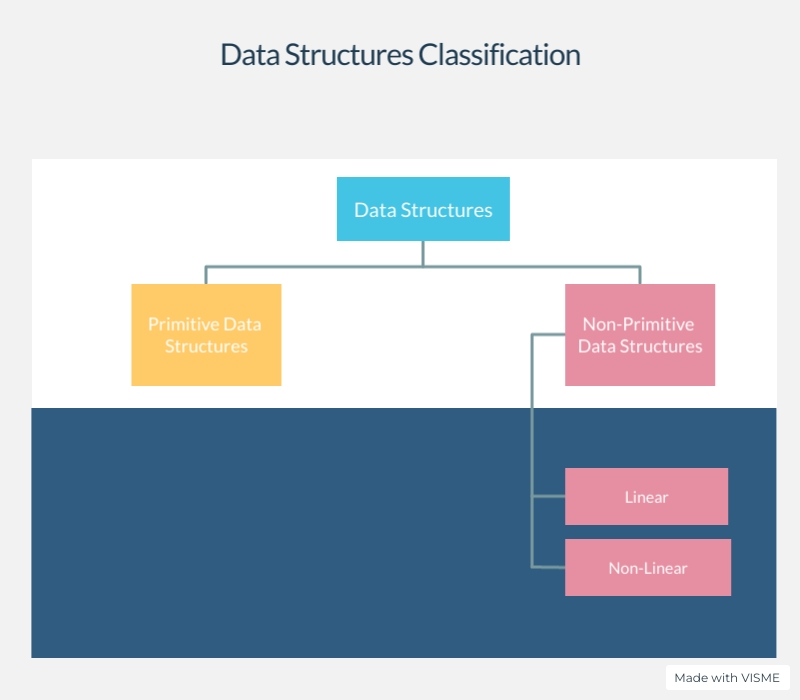

# DATA STRUCTURES THROUGH C

👋 For all the enthusiastics wanting to learn Data Structures👨‍💻, find the code references in the code section of this repository.

Data Structures classification:  

## Arrays ["✌","😂","😝","😁","💛","💚"]
1) Arrays are the homogeneous mixture of data stored in a contiguous blocks of memory and given a common label.
2) Homogeneous refers to all the property that states that all the elements in the array must be of the same data type.
3) Contiguous blocks of memory refers to the nature of array that stores all the elements in the continuous blocks of memory.
Let me use a small analogy to explain the contiguous blocks of memory storage.  
Say there is  an array  
int example_array[4] = {1,2,3,4};  
Here, there are 4 elements in the array, they are stored in the memory block as follows.  
| 100 | 104 | 108 | 112 |  
|-|-|-|-|  

As the integer type in C language consumes 4 bytes, the first element consumed 4 bytes of memory so on and so forth

